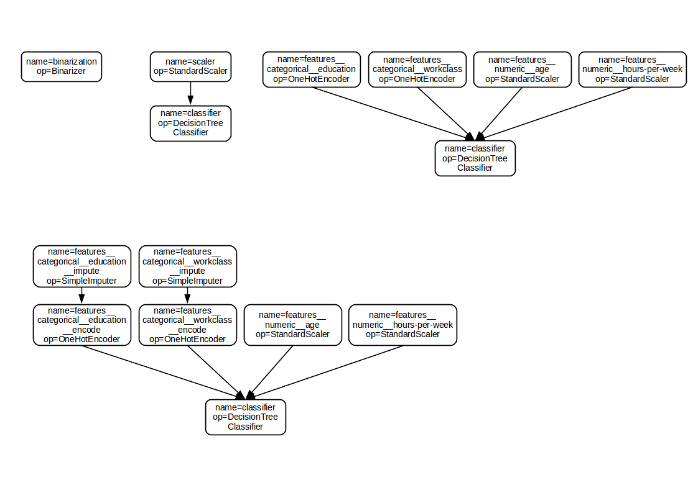

## Task 1: Implementing Layers in a Neural Network

The goal of this [task](task1.py) is to complete the implementation of a neural network for classifying points from a syntheticly generated dataset:

You only have to implement the forward pass; the backward pass and weight updates are already given. The network is defined as follows:  

Implement the forward pass in the [first fully connected layer, which applies a `tanh` non-linearity](components/neuralnetwork.py#L65), in the [second fully connected layer](components/neuralnetwork.py#L42) and in the [softmax output](components/neuralnetwork.py#L87). Finally, invoke your implemented methods to conduct the [full forward pass through the network](components/neuralnetwork.py#L9) and return the computed probabilities. You can execute this task via `python task1.py`

## Task 2, 3 & 4: Translating Scikit-learn Pipelines to Dataflow Graphs

In the remaining three tasks, you have to ...

